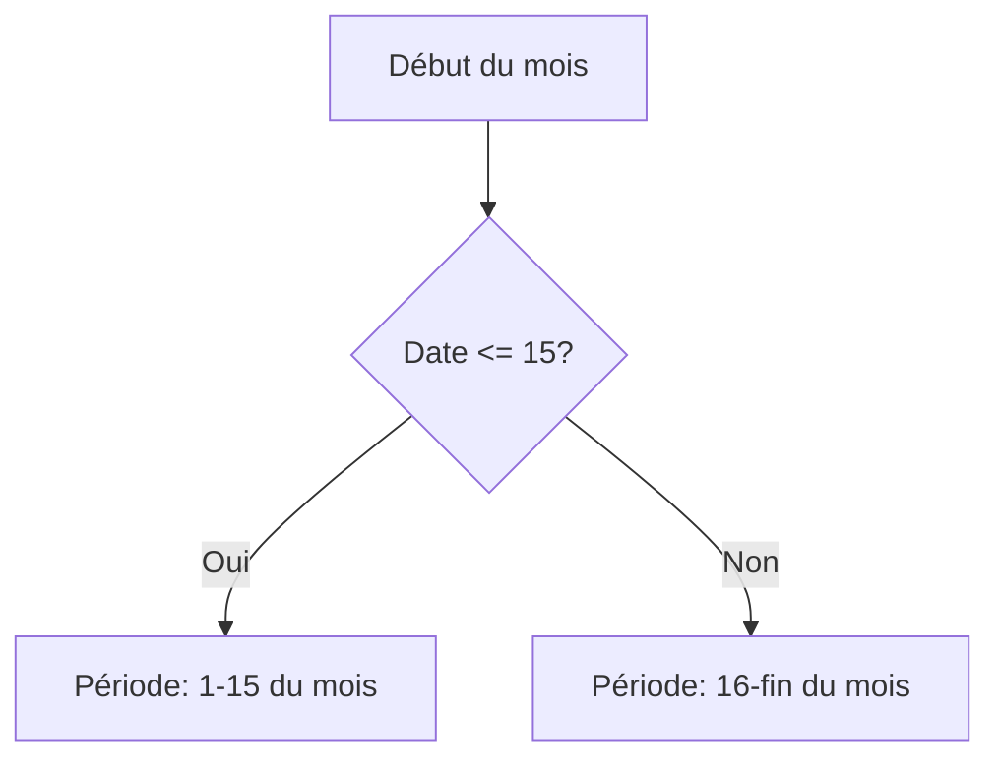
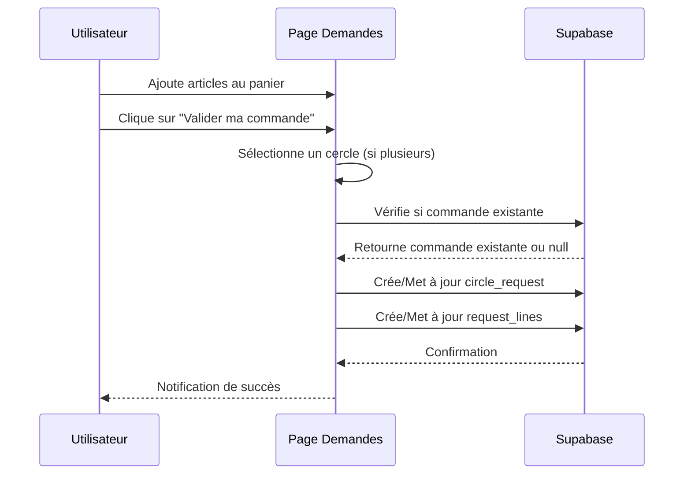
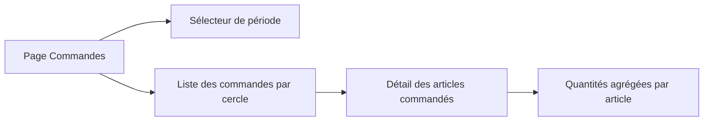
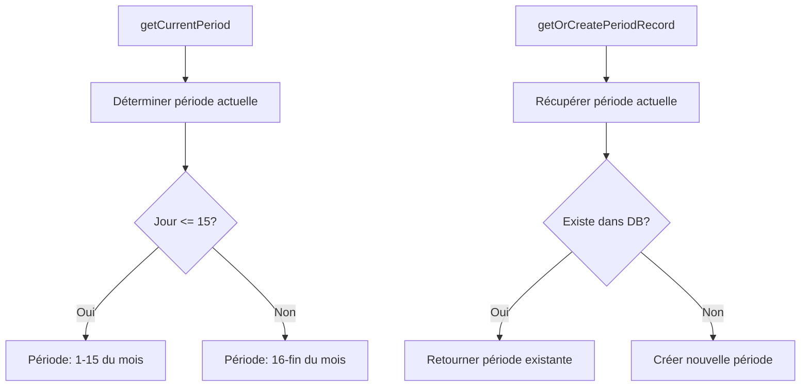
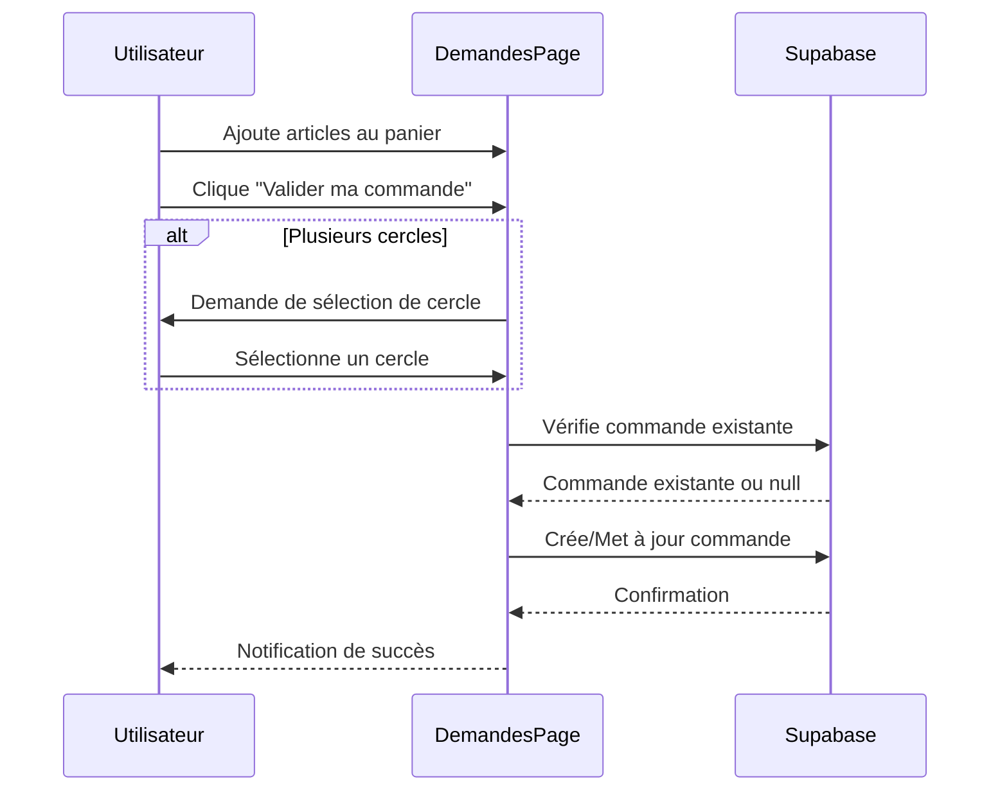
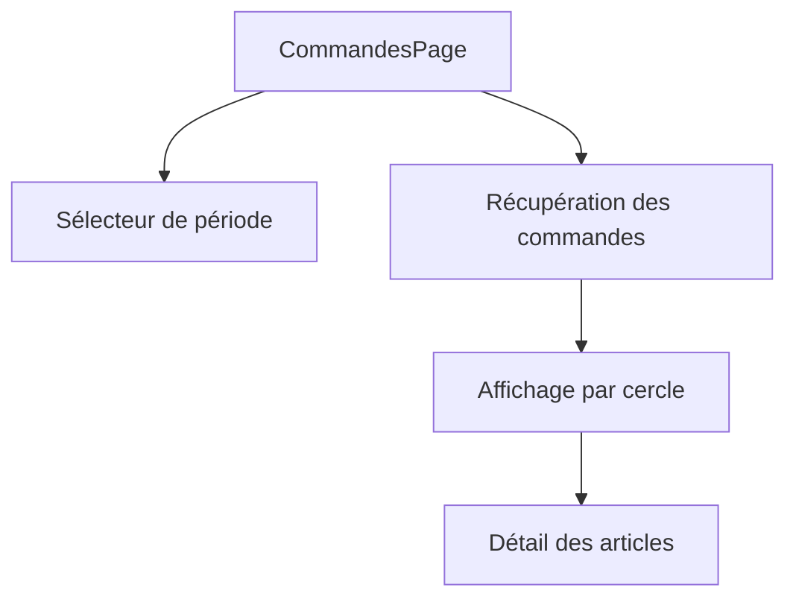

# Plan pour la gestion des commandes par périodes

## Analyse de l'existant

Votre base de données est déjà bien structurée pour supporter cette fonctionnalité :
- Table `articles` pour le catalogue
- Table `circle_requests` pour les demandes par cercle
- Table `order_periods` pour les périodes de commande
- Table `request_lines` pour les lignes de demande
- Table `user_circles` pour l'appartenance des utilisateurs aux cercles

## Fonctionnalités à développer

### 1. Gestion des périodes de commande



- Créer une fonction qui détermine la période en cours en fonction de la date actuelle
- Récupérer ou créer automatiquement l'enregistrement correspondant dans la table `order_periods`

### 2. Modification de la page "Mes demandes"



- Ajouter un bouton "Valider ma commande" en bas de la page
- Afficher la période en cours pour laquelle la commande sera validée
- Si l'utilisateur appartient à plusieurs cercles, lui permettre de choisir le cercle pour lequel il passe la commande
- Lors de la validation, vérifier si une commande existe déjà pour ce cercle et cette période
  - Si oui, mettre à jour les lignes de commande existantes
  - Si non, créer un nouvel enregistrement dans `circle_requests` et des enregistrements dans `request_lines`

### 3. Création d'une page "Commandes par période"



- Créer une nouvelle page accessible depuis la navigation
- Permettre de sélectionner une période (en cours ou passée)
- Afficher les commandes regroupées par cercle
- Pour chaque cercle, afficher les articles commandés avec les quantités agrégées

### 4. Intégration avec Supabase

- Créer des requêtes pour récupérer la période en cours
- Créer des requêtes pour enregistrer/mettre à jour les commandes validées
- Créer des requêtes pour récupérer les commandes par période et par cercle

## Plan d'implémentation

### Étape 1 : Gestion des périodes

1. Créer un fichier `src/utils/periodUtils.ts` avec les fonctions suivantes :
   - `getCurrentPeriod()` : détermine la période en cours (1-15 ou 16-fin du mois)
   - `getOrCreatePeriodRecord()` : récupère ou crée l'enregistrement de période correspondant

```typescript
// src/utils/periodUtils.ts
import { supabase } from '../supabaseClient';

export interface Period {
  id: string;
  nom: string;
  date_limite: string;
  status: 'open' | 'closed' | 'ordered' | 'archived';
}

export function getCurrentPeriod(): { start: Date; end: Date; name: string } {
  const now = new Date();
  const year = now.getFullYear();
  const month = now.getMonth();
  const day = now.getDate();
  
  // Première ou deuxième quinzaine
  if (day <= 15) {
    const start = new Date(year, month, 1);
    const end = new Date(year, month, 15);
    return {
      start,
      end,
      name: `${start.toLocaleDateString('fr-FR', { day: '2-digit', month: 'short' })} - ${end.toLocaleDateString('fr-FR', { day: '2-digit', month: 'short', year: 'numeric' })}`
    };
  } else {
    const start = new Date(year, month, 16);
    const end = new Date(year, month + 1, 0); // Dernier jour du mois
    return {
      start,
      end,
      name: `${start.toLocaleDateString('fr-FR', { day: '2-digit', month: 'short' })} - ${end.toLocaleDateString('fr-FR', { day: '2-digit', month: 'short', year: 'numeric' })}`
    };
  }
}

export async function getOrCreatePeriodRecord(): Promise<Period | null> {
  const period = getCurrentPeriod();
  
  // Vérifier si la période existe déjà
  const { data, error } = await supabase
    .from('order_periods')
    .select('*')
    .eq('nom', period.name)
    .single();
  
  if (data) return data;
  
  // Créer la période si elle n'existe pas
  const { data: newPeriod, error: createError } = await supabase
    .from('order_periods')
    .insert([
      {
        nom: period.name,
        date_limite: period.end.toISOString().split('T')[0],
        status: 'open'
      }
    ])
    .select()
    .single();
  
  if (createError) {
    console.error('Erreur lors de la création de la période:', createError);
    return null;
  }
  
  return newPeriod;
}
```

### Étape 2 : Modification de la page "Mes demandes"

1. Mettre à jour le composant `DemandesPage.tsx` pour ajouter le bouton de validation et la logique associée

```typescript
// src/pages/DemandesPage.tsx (modifications)
import { useState, useEffect } from 'react';
import { Button, FormControl, InputLabel, Select, MenuItem, Box, Typography, Alert } from '@mui/material';
import { supabase } from '../supabaseClient';
import { getOrCreatePeriodRecord, Period } from '../utils/periodUtils';
import type { CartItem } from '../types';

// Ajouter à l'interface existante
interface DemandesPageProps {
  // ... props existantes
  user: User; // Utilisateur connecté
}

export default function DemandesPage({ articles, setArticles, showModal, setShowModal, catalogue, user }: DemandesPageProps) {
  const [currentPeriod, setCurrentPeriod] = useState<Period | null>(null);
  const [userCircles, setUserCircles] = useState<{ id: string; nom: string }[]>([]);
  const [selectedCircle, setSelectedCircle] = useState<string>('');
  const [isSubmitting, setIsSubmitting] = useState(false);
  const [submitSuccess, setSubmitSuccess] = useState(false);
  const [submitError, setSubmitError] = useState<string | null>(null);

  // Récupérer la période en cours
  useEffect(() => {
    async function fetchCurrentPeriod() {
      const period = await getOrCreatePeriodRecord();
      setCurrentPeriod(period);
    }
    fetchCurrentPeriod();
  }, []);

  // Récupérer les cercles de l'utilisateur
  useEffect(() => {
    async function fetchUserCircles() {
      if (!user) return;
      
      const { data, error } = await supabase
        .from('user_circles')
        .select('circles(id, nom)')
        .eq('user_id', user.id);
      
      if (error) {
        console.error('Erreur lors de la récupération des cercles:', error);
        return;
      }
      
      const circles = data.map(item => item.circles);
      setUserCircles(circles);
      
      // Si l'utilisateur n'a qu'un seul cercle, le sélectionner automatiquement
      if (circles.length === 1) {
        setSelectedCircle(circles[0].id);
      }
    }
    fetchUserCircles();
  }, [user]);

  const handleValidateOrder = async () => {
    if (!currentPeriod) {
      setSubmitError('Impossible de déterminer la période en cours');
      return;
    }
    
    if (!selectedCircle) {
      setSubmitError('Veuillez sélectionner un cercle');
      return;
    }
    
    if (articles.length === 0) {
      setSubmitError('Votre panier est vide');
      return;
    }
    
    setIsSubmitting(true);
    setSubmitError(null);
    
    try {
      // Vérifier si une commande existe déjà pour ce cercle et cette période
      const { data: existingRequest, error: fetchError } = await supabase
        .from('circle_requests')
        .select('id')
        .eq('circle_id', selectedCircle)
        .eq('period_id', currentPeriod.id)
        .eq('created_by', user.id)
        .single();
      
      let requestId;
      
      if (existingRequest) {
        // Mettre à jour la commande existante
        requestId = existingRequest.id;
        
        // Supprimer les lignes existantes
        await supabase
          .from('request_lines')
          .delete()
          .eq('request_id', requestId);
      } else {
        // Créer une nouvelle commande
        const { data: newRequest, error: insertError } = await supabase
          .from('circle_requests')
          .insert([
            {
              circle_id: selectedCircle,
              period_id: currentPeriod.id,
              created_by: user.id,
              status: 'draft'
            }
          ])
          .select()
          .single();
        
        if (insertError) throw insertError;
        requestId = newRequest.id;
      }
      
      // Insérer les nouvelles lignes de commande
      const requestLines = articles.map(article => ({
        request_id: requestId,
        article_id: getArticleIdByLibelle(article.libelle), // Fonction à implémenter
        qty: article.quantite
      }));
      
      const { error: linesError } = await supabase
        .from('request_lines')
        .insert(requestLines);
      
      if (linesError) throw linesError;
      
      setSubmitSuccess(true);
      // Vider le panier après validation réussie
      setArticles([]);
    } catch (error) {
      console.error('Erreur lors de la validation de la commande:', error);
      setSubmitError('Une erreur est survenue lors de la validation de la commande');
    } finally {
      setIsSubmitting(false);
    }
  };

  // Fonction pour obtenir l'ID d'un article à partir de son libellé
  const getArticleIdByLibelle = (libelle: string): string => {
    const article = catalogue.find(a => a.libelle === libelle);
    return article ? article.id : '';
  };

  // Rendu existant...
  
  return (
    <div>
      <h1>Mes demandes</h1>
      {/* Contenu existant... */}
      
      {articles.length > 0 && (
        <Box sx={{ mt: 4, p: 2, border: '1px solid #eee', borderRadius: 2 }}>
          <Typography variant="h6" gutterBottom>
            Valider ma commande
          </Typography>
          
          {currentPeriod && (
            <Typography variant="body2" gutterBottom>
              Période de commande : {currentPeriod.nom}
            </Typography>
          )}
          
          {userCircles.length > 1 && (
            <FormControl fullWidth margin="normal">
              <InputLabel id="circle-select-label">Cercle</InputLabel>
              <Select
                labelId="circle-select-label"
                value={selectedCircle}
                onChange={(e) => setSelectedCircle(e.target.value)}
                label="Cercle"
              >
                {userCircles.map(circle => (
                  <MenuItem key={circle.id} value={circle.id}>
                    {circle.nom}
                  </MenuItem>
                ))}
              </Select>
            </FormControl>
          )}
          
          {submitSuccess && (
            <Alert severity="success" sx={{ mt: 2 }}>
              Votre commande a été validée avec succès !
            </Alert>
          )}
          
          {submitError && (
            <Alert severity="error" sx={{ mt: 2 }}>
              {submitError}
            </Alert>
          )}
          
          <Button
            variant="contained"
            color="primary"
            fullWidth
            sx={{ mt: 2 }}
            onClick={handleValidateOrder}
            disabled={isSubmitting || articles.length === 0 || (userCircles.length > 1 && !selectedCircle)}
          >
            {isSubmitting ? 'Validation en cours...' : 'Valider ma commande'}
          </Button>
        </Box>
      )}
    </div>
  );
}
```

### Étape 3 : Création de la page "Commandes par période"

1. Créer un nouveau composant `src/pages/CommandesPage.tsx`

```typescript
// src/pages/CommandesPage.tsx
import { useState, useEffect } from 'react';
import {
  Box,
  Typography,
  FormControl,
  InputLabel,
  Select,
  MenuItem,
  Paper,
  Table,
  TableBody,
  TableCell,
  TableContainer,
  TableHead,
  TableRow,
  Accordion,
  AccordionSummary,
  AccordionDetails
} from '@mui/material';
import ExpandMoreIcon from '@mui/icons-material/ExpandMore';
import { supabase } from '../supabaseClient';
import type { User } from '@supabase/supabase-js';
import type { CatalogueItem } from '../types';

interface CommandesPageProps {
  user: User;
}

interface Period {
  id: string;
  nom: string;
  date_limite: string;
  status: string;
}

interface CircleOrder {
  circle_id: string;
  circle_nom: string;
  articles: {
    article_id: string;
    libelle: string;
    ref: string;
    fournisseur: string;
    prix_unitaire: number;
    total_qty: number;
  }[];
}

export default function CommandesPage({ user }: CommandesPageProps) {
  const [periods, setPeriods] = useState<Period[]>([]);
  const [selectedPeriod, setSelectedPeriod] = useState<string>('');
  const [circleOrders, setCircleOrders] = useState<CircleOrder[]>([]);
  const [loading, setLoading] = useState(true);
  
  // Récupérer toutes les périodes
  useEffect(() => {
    async function fetchPeriods() {
      const { data, error } = await supabase
        .from('order_periods')
        .select('*')
        .order('date_limite', { ascending: false });
      
      if (error) {
        console.error('Erreur lors de la récupération des périodes:', error);
        return;
      }
      
      setPeriods(data || []);
      if (data && data.length > 0) {
        setSelectedPeriod(data[0].id);
      }
    }
    fetchPeriods();
  }, []);
  
  // Récupérer les commandes pour la période sélectionnée
  useEffect(() => {
    async function fetchOrdersForPeriod() {
      if (!selectedPeriod) return;
      
      setLoading(true);
      
      // Récupérer les cercles auxquels l'utilisateur appartient
      const { data: userCircles, error: circlesError } = await supabase
        .from('user_circles')
        .select('circle_id')
        .eq('user_id', user.id);
      
      if (circlesError) {
        console.error('Erreur lors de la récupération des cercles:', circlesError);
        setLoading(false);
        return;
      }
      
      const circleIds = userCircles.map(uc => uc.circle_id);
      
      // Récupérer les commandes pour ces cercles et cette période
      const { data: requests, error: requestsError } = await supabase
        .from('circle_requests')
        .select(`
          id,
          circles (id, nom),
          request_lines (
            id,
            qty,
            articles (
              id,
              libelle,
              ref,
              fournisseur,
              prix_unitaire
            )
          )
        `)
        .eq('period_id', selectedPeriod)
        .in('circle_id', circleIds);
      
      if (requestsError) {
        console.error('Erreur lors de la récupération des commandes:', requestsError);
        setLoading(false);
        return;
      }
      
      // Transformer les données pour les regrouper par cercle et agréger les quantités
      const ordersByCircle: Record<string, CircleOrder> = {};
      
      requests.forEach(request => {
        const circleId = request.circles.id;
        const circleName = request.circles.nom;
        
        if (!ordersByCircle[circleId]) {
          ordersByCircle[circleId] = {
            circle_id: circleId,
            circle_nom: circleName,
            articles: []
          };
        }
        
        request.request_lines.forEach(line => {
          const article = line.articles;
          const existingArticle = ordersByCircle[circleId].articles.find(a => a.article_id === article.id);
          
          if (existingArticle) {
            existingArticle.total_qty += line.qty;
          } else {
            ordersByCircle[circleId].articles.push({
              article_id: article.id,
              libelle: article.libelle,
              ref: article.ref,
              fournisseur: article.fournisseur,
              prix_unitaire: article.prix_unitaire,
              total_qty: line.qty
            });
          }
        });
      });
      
      setCircleOrders(Object.values(ordersByCircle));
      setLoading(false);
    }
    
    fetchOrdersForPeriod();
  }, [selectedPeriod, user.id]);
  
  return (
    <div>
      <Typography variant="h4" gutterBottom>
        Commandes par période
      </Typography>
      
      <FormControl fullWidth margin="normal">
        <InputLabel id="period-select-label">Période</InputLabel>
        <Select
          labelId="period-select-label"
          value={selectedPeriod}
          onChange={(e) => setSelectedPeriod(e.target.value)}
          label="Période"
        >
          {periods.map(period => (
            <MenuItem key={period.id} value={period.id}>
              {period.nom} ({period.status})
            </MenuItem>
          ))}
        </Select>
      </FormControl>
      
      {loading ? (
        <Typography>Chargement des commandes...</Typography>
      ) : circleOrders.length === 0 ? (
        <Typography>Aucune commande pour cette période</Typography>
      ) : (
        <Box sx={{ mt: 3 }}>
          {circleOrders.map(order => (
            <Accordion key={order.circle_id} sx={{ mb: 2 }}>
              <AccordionSummary expandIcon={<ExpandMoreIcon />}>
                <Typography variant="h6">{order.circle_nom}</Typography>
              </AccordionSummary>
              <AccordionDetails>
                <TableContainer component={Paper}>
                  <Table>
                    <TableHead>
                      <TableRow>
                        <TableCell>Référence</TableCell>
                        <TableCell>Libellé</TableCell>
                        <TableCell>Fournisseur</TableCell>
                        <TableCell>Prix unitaire</TableCell>
                        <TableCell>Quantité</TableCell>
                        <TableCell>Total</TableCell>
                      </TableRow>
                    </TableHead>
                    <TableBody>
                      {order.articles.map(article => (
                        <TableRow key={article.article_id}>
                          <TableCell>{article.ref}</TableCell>
                          <TableCell>{article.libelle}</TableCell>
                          <TableCell>{article.fournisseur}</TableCell>
                          <TableCell>{article.prix_unitaire} €</TableCell>
                          <TableCell>{article.total_qty}</TableCell>
                          <TableCell>{(article.prix_unitaire * article.total_qty).toFixed(2)} €</TableCell>
                        </TableRow>
                      ))}
                    </TableBody>
                  </Table>
                </TableContainer>
              </AccordionDetails>
            </Accordion>
          ))}
        </Box>
      )}
    </div>
  );
}
```

### Étape 4 : Mise à jour de la navigation

1. Mettre à jour le fichier `App.tsx` pour ajouter la nouvelle page à la navigation

```typescript
// src/App.tsx (modifications)
import { useState, useEffect } from 'react';
import { supabase } from './supabaseClient';
import type { User } from '@supabase/supabase-js';
import './App.css';
import { getTestUser, getTestProfile } from './testData.ts';
import type { UserProfile } from './testData.ts';
import type { CatalogueItem, CartItem } from './types';
import ProfilPage from './pages/ProfilPage';
import DemandesPage from './pages/DemandesPage';
import CataloguePage from './pages/CataloguePage';
import CommandesPage from './pages/CommandesPage'; // Importer la nouvelle page
import { Button, Container, Box, Typography, AppBar, Toolbar, BottomNavigation, BottomNavigationAction } from '@mui/material';
import RestoreIcon from '@mui/icons-material/Restore';
import FavoriteIcon from '@mui/icons-material/Favorite';
import LocationOnIcon from '@mui/icons-material/LocationOn';
import ListAltIcon from '@mui/icons-material/ListAlt'; // Icône pour la page Commandes

function App() {
  // États existants...
  
  // Mettre à jour le type de page pour inclure 'commandes'
  const [page, setPage] = useState<'demandes' | 'catalogue' | 'profil' | 'commandes'>('demandes');
  
  // Reste du code existant...
  
  return (
    <>
      {/* AppBar existant... */}
      <Container maxWidth="md" style={{ paddingTop: '30px', paddingBottom: '56px' }}>
        {/* Code existant... */}
        {user && (
          <>
            {page === 'demandes' && (
              <DemandesPage
                articles={articles}
                setArticles={setArticles}
                showModal={showModal}
                setShowModal={setShowModal}
                catalogue={catalogue}
                user={user} // Ajouter l'utilisateur connecté
              />
            )}
            {page === 'catalogue' && (
              <CataloguePage
                catalogue={catalogue}
                articles={articles}
                setArticles={setArticles}
              />
            )}
            {page === 'profil' && (
              <ProfilPage
                user={user}
                userProfile={userProfile}
              />
            )}
            {page === 'commandes' && (
              <CommandesPage
                user={user}
              />
            )}
          </>
        )}
      </Container>
      <AppBar position="fixed" style={{ top: 'auto', bottom: 0 }}>
        <BottomNavigation
          value={page}
          onChange={(event, newValue) => {
            setPage(newValue);
          }}
          showLabels
        >
          <BottomNavigationAction label="Demandes" value="demandes" icon={<RestoreIcon />} />
          <BottomNavigationAction label="Catalogue" value="catalogue" icon={<FavoriteIcon />} />
          <BottomNavigationAction label="Commandes" value="commandes" icon={<ListAltIcon />} />
          <BottomNavigationAction label="Profil" value="profil" icon={<LocationOnIcon />} />
        </BottomNavigation>
      </AppBar>
    </>
  );
}

export default App;
```

## Conclusion

Cette implémentation permettra de gérer les commandes par périodes de 15 jours, avec les fonctionnalités suivantes :

1. Détermination automatique de la période en cours
2. Validation des commandes pour un cercle spécifique
3. Fusion des commandes multiples dans la même période
4. Possibilité de modifier les commandes tant que la période est ouverte
5. Visualisation des commandes par période et par cercle, avec agrégation des quantités

Le plan est modulaire et peut être implémenté par étapes, en commençant par la gestion des périodes, puis la validation des commandes, et enfin la visualisation des commandes par période.

## Plan d'implémentation finalisé

Suite à notre discussion, voici le plan d'implémentation finalisé qui tient compte de vos préférences :

1. Interface simple avec bouton et confirmation pour la validation des commandes
2. Demande de sélection de cercle à chaque validation si l'utilisateur appartient à plusieurs cercles
3. Visibilité de toutes les commandes pour tous les utilisateurs

### 1. Création des utilitaires de gestion des périodes



Le fichier `src/utils/periodUtils.ts` contiendra les fonctions nécessaires pour gérer les périodes de commande, comme décrit dans le plan initial.

### 2. Modification de la page "Mes demandes"



Les modifications de `DemandesPage.tsx` incluront :
- Ajout de la propriété `user` aux props
- États pour la période, les cercles et la validation
- Interface simplifiée avec un bouton de validation et une boîte de dialogue simple pour la sélection du cercle si nécessaire
- Messages de confirmation après validation réussie

### 3. Création de la page "Commandes par période"



Le nouveau fichier `src/pages/CommandesPage.tsx` permettra :
- De sélectionner une période en haut de la page
- D'afficher toutes les commandes pour tous les cercles
- De visualiser les articles commandés avec quantités et totaux
- De calculer les totaux par article et par cercle

### 4. Mise à jour de la navigation principale

Les modifications de `App.tsx` incluront :
- Ajout du composant `CommandesPage`
- Mise à jour du type de page pour inclure 'commandes'
- Ajout d'un nouvel onglet "Commandes" dans la barre de navigation
- Passage de l'utilisateur connecté aux composants

### Étapes d'implémentation

1. Créer les utilitaires de gestion des périodes
2. Modifier la page des demandes pour ajouter la validation
3. Créer la page des commandes par période
4. Mettre à jour la navigation principale

Cette approche permet une implémentation progressive et modulaire, en commençant par les fonctionnalités de base et en ajoutant progressivement les fonctionnalités plus complexes.